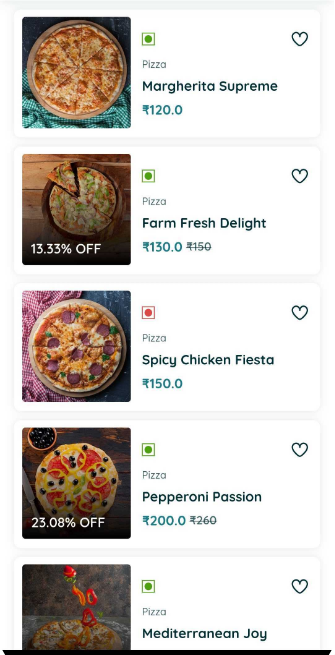
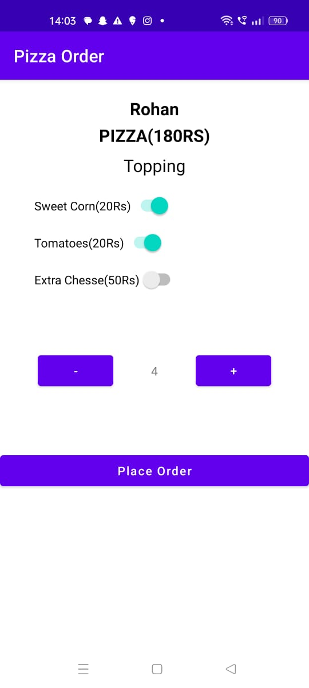

# Demo App

<table style="width:100%">
  <tr>
    <th>Example 1</th>
    <th>Example 2</th>
  </tr>
  <tr>
    <td></td>
    <td></td>
  </tr>
  <tr>
    <th>Example 3</th>
    <th>Example 4</th>
  </tr>
  <tr>
    <td></td>
    <td></td>
    
  </tr>

  <tr>
    <td></td>
    <td></td>
  </tr>

  <tr>
    <td></td>
    
  </tr>
</table>
